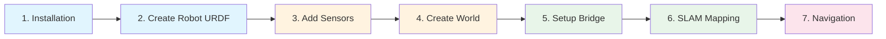

# ROS2 Gazebo Simulation Guide

---

## 🎯 What is This Guide?

This comprehensive guide walks you through setting up a complete **robot simulation environment** using:

- **ROS2 Humble** - The latest LTS release of Robot Operating System 2
- **Ignition Gazebo Fortress** - Modern robotics simulator
- **Navigation2** - Autonomous navigation stack
- **SLAM Toolbox** - Simultaneous Localization and Mapping

By the end, you'll have a fully functional simulation with a differential drive robot that can:

- ✅ Navigate autonomously
- ✅ Create maps using SLAM
- ✅ Use LiDAR, Camera, and IMU sensors
- ✅ Follow waypoints and avoid obstacles

---

## 🚀 Quick Start

### Prerequisites

!!! info "System Requirements"
    - Ubuntu 22.04 LTS
    - 8GB+ RAM recommended
    - GPU with OpenGL 3.3+ support

### Installation (5 minutes)

```bash
# Install ROS2 Humble
sudo apt install ros-humble-desktop

# Install Ignition Gazebo Fortress
sudo apt install ignition-fortress

# Install ROS-Gazebo bridge
sudo apt install ros-humble-ros-gz

# Install Navigation & SLAM
sudo apt install ros-humble-navigation2 ros-humble-slam-toolbox
```

### Launch Simulation

```bash
# Clone the repository
git clone https://github.com/kamlesh-ks/ros2-gazebo-guide.git
cd ros2-gazebo-guide

# Build
colcon build
source install/setup.bash

# Launch with SLAM (for mapping)
ros2 launch my_robot_sim full_simulation.launch.py slam:=true

# OR launch with Navigation (using saved map)
ros2 launch my_robot_sim full_simulation.launch.py nav:=true
```

---

## 📚 Documentation Structure

<div class="grid cards" markdown>

-   :material-download:{ .lg .middle } __Getting Started__

    ---

    Installation, prerequisites, and first steps

    [:octicons-arrow-right-24: Get Started](getting-started/overview.md)

-   :material-robot:{ .lg .middle } __Robot Setup__

    ---

    URDF model, sensors, and Gazebo plugins

    [:octicons-arrow-right-24: Robot Setup](robot/urdf-basics.md)

-   :material-cube-outline:{ .lg .middle } __Simulation__

    ---

    World creation, bridges, and launch files

    [:octicons-arrow-right-24: Simulation](simulation/world-creation.md)

-   :material-map:{ .lg .middle } __SLAM & Mapping__

    ---

    Create maps with SLAM Toolbox

    [:octicons-arrow-right-24: SLAM](slam/slam-toolbox.md)

-   :material-navigation:{ .lg .middle } __Navigation__

    ---

    Autonomous navigation with Nav2

    [:octicons-arrow-right-24: Navigation](navigation/nav2-setup.md)

-   :material-book-open-variant:{ .lg .middle } __Reference__

    ---

    Troubleshooting, commands, resources

    [:octicons-arrow-right-24: Reference](reference/troubleshooting.md)

</div>

---

## 🏗️ Architecture Overview

```
┌─────────────────────────────────────────────────────────────────────────┐
│                           YOUR APPLICATION                              │
│                    (Navigation Goals, Behaviors)                        │
└───────────────────────────────────┬─────────────────────────────────────┘
                                    │
┌───────────────────────────────────┴───────────────────────────────────── ┐
│                              ROS2 HUMBLE                                 │
│  ┌──────────┐  ┌──────────┐  ┌──────────┐  ┌──────────────────────┐      │
│  │Navigation│  │   SLAM   │  │   RViz   │  │  Robot State         │      │
│  │  Stack   │  │ Toolbox  │  │          │  │  Publisher           │      │
│  │  (Nav2)  │  │          │  │          │  │                      │      │
│  └────┬─────┘  └────┬─────┘  └────┬─────┘  └──────────┬───────────┘      │
│       └─────────────┴─────────────┴──────────────────┬┘                  │
│                              │                                           │
│                    ROS2 Topics/Services/Actions                          │
│                              │                                           │
└──────────────────────────────┼───────────────────────────────────────────┘
                               │
                  ┌────────────┴────────────┐
                  │     ros_gz_bridge       │
                  │  (Message Translation)  │
                  └────────────┬────────────┘
                               │
┌──────────────────────────────┼───────────────────────────────────────────┐
│              IGNITION GAZEBO FORTRESS                                    │
│                              │                                           │
│  ┌───────────────────────────┴───────────────────────────────────────┐   │
│  │                      Physics Engine                               │   │
│  └───────────────────────────────────────────────────────────────────┘   │
│                                                                          │
│  ┌────────────┐  ┌────────────┐  ┌────────────┐  ┌────────────┐          │
│  │   Robot    │  │   LiDAR    │  │   Camera   │  │    IMU     │          │
│  │   Model    │  │   Sensor   │  │   Sensor   │  │   Sensor   │          │
│  └────────────┘  └────────────┘  └────────────┘  └────────────┘          │
│                                                                          │
│  ┌───────────────────────────────────────────────────────────────────┐   │
│  │                         WORLD                                     │   │
│  │              (walls, obstacles, ground plane)                     │   │
│  └───────────────────────────────────────────────────────────────────┘   │
│                                                                          │
└──────────────────────────────────────────────────────────────────────────┘
```

---

## 📊 Topics & Data Flow

| Direction    | Topic               | Message Type            | Description       |
| ------------ | ------------------- | ----------------------- | ----------------- |
| Gazebo → ROS | `/scan`             | `sensor_msgs/LaserScan` | LiDAR data        |
| Gazebo → ROS | `/odom`             | `nav_msgs/Odometry`     | Wheel odometry    |
| Gazebo → ROS | `/imu`              | `sensor_msgs/Imu`       | IMU data          |
| Gazebo → ROS | `/camera/image_raw` | `sensor_msgs/Image`     | Camera images     |
| ROS → Gazebo | `/cmd_vel`          | `geometry_msgs/Twist`   | Velocity commands |

---

## 🎓 Learning Path



| Phase          | Topics                        | Time    |
| -------------- | ----------------------------- | ------- |
| **Setup**      | Installation, Environment     | 30 min  |
| **Robot**      | URDF, Xacro, Sensors, Plugins | 2 hours |
| **Simulation** | World, Bridge, Launch         | 1 hour  |
| **SLAM**       | Mapping, Map Saving           | 1 hour  |
| **Navigation** | Nav2, AMCL, Planning          | 2 hours |

---

## 📁 Package Structure

```
my_robot_sim/
├── CMakeLists.txt
├── package.xml
├── urdf/
│   ├── robot.urdf.xacro        # Robot description
│   └── gazebo_plugins.xacro    # Sensor configs
├── worlds/
│   └── my_world.sdf            # Simulation world
├── launch/
│   ├── gazebo.launch.py        # Launch Gazebo
│   ├── slam.launch.py          # Launch SLAM
│   ├── navigation.launch.py    # Launch Nav2
│   └── full_simulation.launch.py
├── config/
│   ├── bridge.yaml             # ROS-Gazebo bridge
│   ├── slam_params.yaml        # SLAM parameters
│   ├── nav2_params.yaml        # Navigation params
│   └── simulation.rviz         # RViz config
└── maps/
    ├── my_map.pgm              # Saved map
    └── my_map.yaml             # Map metadata
```

---

## 🆘 Need Help?

!!! tip "Useful Commands"
    See the [Commands Cheatsheet](reference/commands.md) for quick reference.

---

## 🤝 Contributing

Contributions are welcome! Please feel free to submit a Pull Request.

1. Fork the repository
2. Create your feature branch (`git checkout -b feature/feature-xyz`)
3. Commit your changes (`git commit -m 'Add some feature-xyz'`)
4. Push to the branch (`git push origin feature/feature-xyz`)
5. Open a Pull Request

---

## 📄 License

This project is licensed under the Apache 2.0 License - see the [LICENSE](https://github.com/kamlesh-ks/ros2-gazebo-guide/blob/main/LICENSE) file for details.

---
